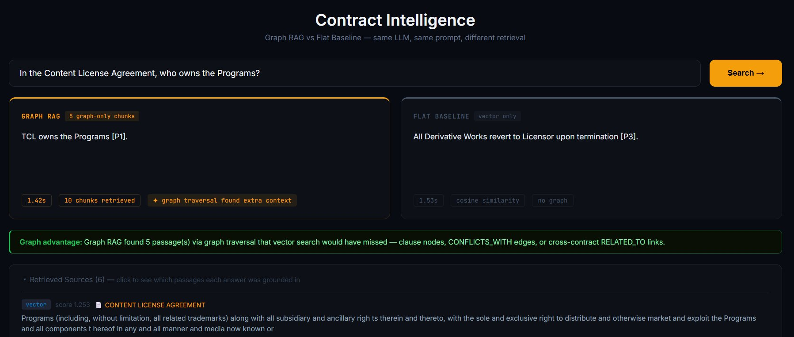
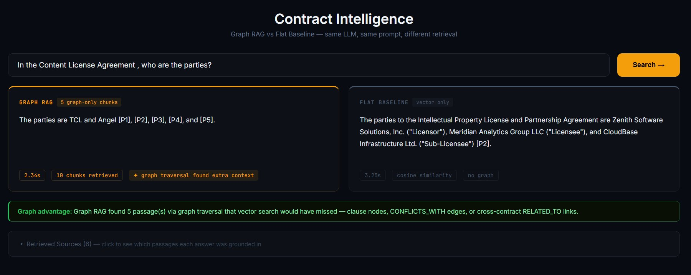
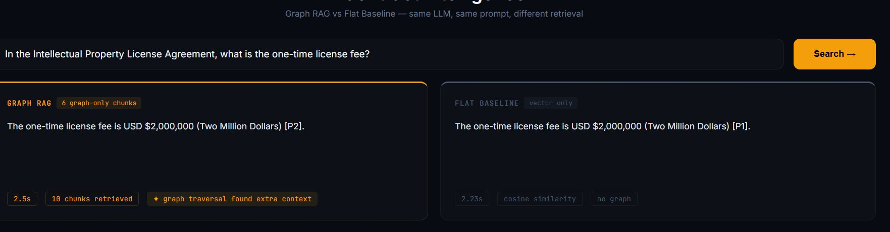
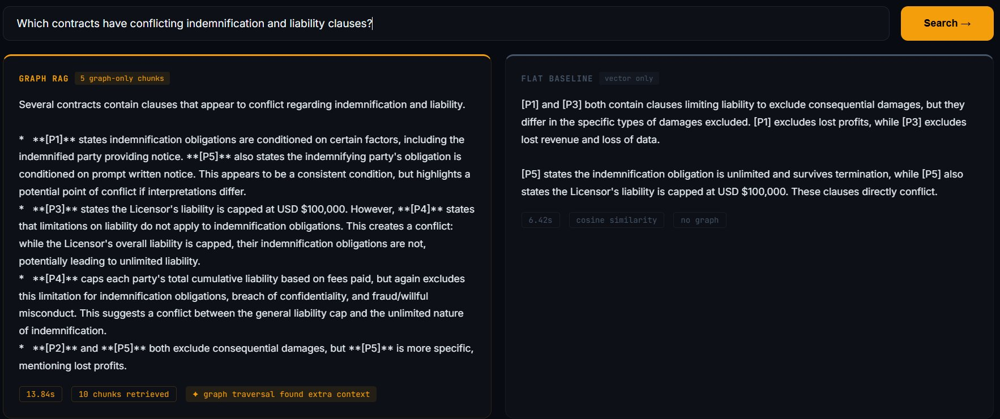
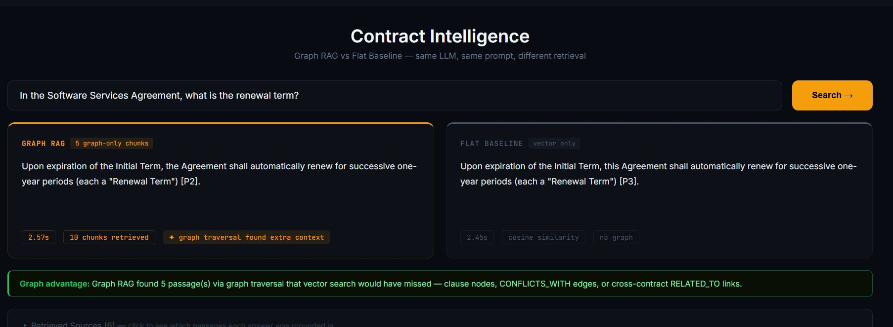

# Legal Graph RAG

A Graph-Augmented Retrieval system for legal contract intelligence. Upload contracts, extract a knowledge graph of parties, clauses, obligations, and risk flags, then ask complex questions that require traversing relationships across documents.

---

## Motivation

Standard RAG systems fail at multi-hop, relational legal queries such as:

> "Which contracts have unlimited indemnification but a liability cap, creating a legal conflict?"

Answering this requires graph traversal: `Clause{type:indemnification}` -> `CONFLICTS_WITH` -> `Clause{type:limitation_of_liability}`. This project builds that graph automatically from any uploaded contract and enables such queries through a hybrid retrieval pipeline.

---

## Methodology

This project follows a Graph-Augmented Retrieval-Augmented Generation (Graph RAG) approach, combining structured knowledge graph traversal with dense vector retrieval and large language model generation. The pipeline has three main stages:

**1. Ingestion and Knowledge Graph Construction**

Each uploaded contract is processed through a multi-step pipeline: text extraction, sentence-aware chunking with section-header detection, batch embedding using a local sentence transformer model, and LLM-based entity extraction. Extracted entities (parties, clauses, obligations, risk flags, jurisdictions) are stored as nodes in a Neo4j knowledge graph. Edges encode relationships such as conflicts, shared parties across contracts, semantic similarity between chunks, and sequential document order.

**2. Hybrid Retrieval**

At query time, five retrieval strategies are combined and deduplicated:
- Vector search over chunk embeddings using a Neo4j vector index
- Clause-type search via graph traversal from detected clause nodes
- Comparative search when multiple clause types are detected in the query
- Graph expansion via SIMILAR_TO and NEXT edges from seed chunks
- Structured Cypher queries targeting risk flags, conflicts, party mentions, and obligations

Results are re-ranked using keyword overlap scoring before being passed to the language model.

**3. Answer Generation with Comparison**

Two answer modes are generated in parallel for each query:
- Graph RAG: context from the hybrid retrieval pipeline, answered by a local LLM
- Baseline RAG: context from flat vector-only retrieval, answered by the same LLM

This side-by-side comparison allows direct evaluation of the graph retrieval benefit over flat vector search.

---

## Technologies

| Component | Technology |
|---|---|
| Knowledge graph | Neo4j 5.x with vector index support |
| Relational storage | PostgreSQL 15 |
| Task queue | Celery with Redis broker |
| Embeddings | sentence-transformers/all-mpnet-base-v2 (local, 768-dim) |
| LLM | Ollama with Gemma3:12b (local, no API cost) |
| API | FastAPI |
| Frontend | React with D3.js for interactive graph visualization |
| Deployment | Docker Compose |

---

## Results

The screenshots below compare Graph RAG against the flat vector baseline across different query categories. All queries use the same LLM and the same prompt — only the retrieval method differs.

### Factual Lookup

Query: "In the Content License Agreement, who owns the Programs?"
Graph RAG correctly identifies TCL as the owner. Baseline returns an unrelated termination clause.



---

Query: "In the Content License Agreement, who are the parties?"
Graph RAG correctly returns TCL and Angel, scoped to the right contract via graph-linked party nodes. Baseline returns parties from a different contract (Zenith, Meridian, CloudBase from the IP License Agreement), failing to scope the answer to the queried contract.



---

Query: "In the Intellectual Property License Agreement, what is the one-time license fee?"
Both systems return the correct answer (USD $2,000,000), showing agreement on straightforward factual lookups.



---

### Cross-Document Query

Query: "Do any contracts share the same parties?"
Graph RAG traverses RELATED_TO edges to identify that ACME TECHNOLOGIES CORPORATION and ZENITH SOFTWARE SOLUTIONS, INC. share parties across contracts. Baseline returns "The provided contracts do not contain sufficient information to answer this question."



---

### Multi-Hop / Conflict Detection

Query: "Which contracts have conflicting indemnification and liability clauses?"
Graph RAG uses CONFLICTS_WITH edges to provide a detailed breakdown of specific conflicts across multiple passages. Baseline produces a partial answer from cosine similarity alone, missing the structural conflict relationships.


---

### Clause-Specific Retrieval

Query: "In the Software Services Agreement, what is the renewal term?"
Both systems return the correct renewal term. Graph RAG retrieves it via clause-type graph traversal (5 graph-only chunks); baseline retrieves it via vector similarity, showing that for well-scoped clause queries both approaches converge.



---

## Comparison with Standard RAG

| Feature | Standard RAG | This Project |
|---|---|---|
| UI | N/A | React + D3.js interactive graph |
| Metadata storage | Flat vector store | Neo4j + PostgreSQL |
| Processing | Synchronous | Async Celery workers |
| LLM | External API | Ollama Gemma3:12b (local) |
| Retrieval strategies | 1 (vector) | 5 + keyword rerank |
| Answer modes | Single | 2-way: Graph RAG + Baseline RAG |
| Conflict detection | No | Auto-detects contradicting clauses via CONFLICTS_WITH edges |
| Risk flag nodes | No | LLM extracts risks as queryable graph nodes |
| Cross-contract linking | No | RELATED_TO edges for shared parties |
| Risk dashboard | No | Dedicated risks page with severity filter |
| Query history | No | PostgreSQL persistent history |

---

## Knowledge Graph Schema

**Nodes:**

- `Contract` - id, title, contract_type, effective_date, jurisdiction
- `Party` - name, type
- `Clause` - id, type, summary, risk_level
- `Obligation` - description, party, deadline
- `Jurisdiction` - name
- `RiskFlag` - type, severity, description, clause_ref
- `Chunk` - id, text, embedding

**Relationships:**

- `(Contract)-[:HAS_PARTY {role}]->(Party)`
- `(Party)-[:PARTY_TO]->(Contract)`
- `(Contract)-[:CONTAINS]->(Clause)`
- `(Contract)-[:GOVERNED_BY]->(Jurisdiction)`
- `(Contract)-[:RELATED_TO {shared_party}]->(Contract)` — novel: links contracts sharing parties
- `(Contract)-[:HAS_RISK]->(RiskFlag)` — novel
- `(Clause)-[:CONFLICTS_WITH {reason}]->(Clause)` — novel: auto-detected contradictions
- `(Clause)-[:SIMILAR_TO {score}]->(Clause)`
- `(Chunk)-[:SIMILAR_TO {score}]->(Chunk)`
- `(Chunk)-[:NEXT]->(Chunk)`

---

## Architecture Overview

```
Contract Upload (PDF/TXT)
        |
        v
Celery Worker (async background)
        |
        |-- Text Extraction (PyPDF2)
        |-- Chunking (200 words, 40 overlap, section-aware)
        |-- Embedding (sentence-transformers, local)
        |-- LLM Entity Extraction (Ollama Gemma3:12b)
        |     -> Parties, Clauses, Obligations, Risk Flags as JSON
        -> Neo4j Graph Build
              |-- Contract, Party, Clause, Obligation, Jurisdiction nodes
              |-- RiskFlag nodes
              |-- CONFLICTS_WITH edges (indemnification vs liability cap)
              |-- RELATED_TO edges (shared parties across contracts)
              -> SIMILAR_TO semantic edges on chunks

Query
  |
  |-- Query Classification (Ollama)
  |-- 5-Strategy Retrieval
  |     |-- Vector Search (semantic similarity via Neo4j vector index)
  |     |-- Clause Search (graph: Clause -> Contract -> Chunk)
  |     |-- Graph Expansion (SIMILAR_TO traversal)
  |     |-- Structured Cypher (risk, party, conflict, obligation queries)
  |     -> Sequential Context (NEXT edge neighbors)
  |
  |-- Graph RAG Answer (Gemma3:12b)
  -> Flat Baseline (vector-only, for comparison)
```

---

## Example Queries Demonstrating Graph Value

These queries are not answerable by flat vector search alone:

```
"Which contracts have indemnification clauses but no limitation of liability?"
-> Contract-[CONTAINS]->Clause{type:indemnification}
   AND NOT Contract-[CONTAINS]->Clause{type:limitation_of_liability}

"Find all contracts where CloudBase is a party"
-> Party{name:CloudBase}-[PARTY_TO]->Contract

"Which clauses conflict with each other?"
-> Clause-[CONFLICTS_WITH]->Clause

"What are the riskiest contracts we have?"
-> Contract-[HAS_RISK]->RiskFlag{severity:high}

"Which contracts auto-renew and what are their notice periods?"
-> Clause{type:termination} containing auto-renewal terms
```

---

## Sample Dataset

Three contracts are included to demonstrate cross-contract graph traversal:

- `nda_acme_zenith.txt` — NDA between Acme and Zenith
- `software_services_acme_cloudbase.txt` — Services agreement (Acme and CloudBase)
- `ip_license_zenith_meridian.txt` — IP license (Zenith, Meridian, CloudBase; intentional conflicts)

Shared parties (Acme, Zenith, CloudBase) create RELATED_TO edges between contracts. The IP license includes deliberate CONFLICTS_WITH edges between indemnification and liability cap clauses.

### Using the CUAD Dataset (510 real contracts)

```bash
cd data
pip install datasets
python download_cuad.py
```

---

## Quick Start (Docker)

```bash
# Prerequisites
ollama serve
ollama pull gemma3:12b

# Setup
git clone https://github.com/yourusername/legal-graph-rag
cd legal-graph-rag
cp .env.example .env
docker-compose up --build

# Create Neo4j vector indexes (http://localhost:7474, login neo4j/legalrag)
CALL db.index.vector.createNodeIndex('chunk_vector','Chunk','embedding',768,'cosine')
CALL db.index.vector.createNodeIndex('clause_vector','Clause','embedding',768,'cosine')

# Open UI: http://localhost:3000
# Upload contracts from data/sample_contracts/
```

## Run Without Docker

```bash
# Start dependencies
docker run -d -p 7474:7474 -p 7687:7687 -e NEO4J_AUTH=neo4j/legalrag neo4j:5.13.0
docker run -d -p 5432:5432 -e POSTGRES_DB=legalrag -e POSTGRES_USER=admin -e POSTGRES_PASSWORD=legalrag postgres:15-alpine
docker run -d -p 6379:6379 redis:7-alpine

# Backend (terminal 1)
cd backend && pip install -r requirements.txt
uvicorn main:app --reload --port 8000

# Celery worker (terminal 2)
cd backend && celery -A celery_app worker --loglevel=info

# Frontend (terminal 3)
cd frontend && npm install && npm start
```

---

## Project Structure

```
legal-graph-rag/
├── backend/
│   ├── main.py           FastAPI REST API
│   ├── ingestion.py      Contract processing pipeline
│   ├── retrieval.py      5-strategy graph retrieval
│   ├── celery_app.py     Async task queue
│   ├── graph_db.py       Neo4j schema and connection
│   ├── postgres_db.py    PostgreSQL operations
│   ├── ollama_utils.py   LLM interface
│   ├── embeddings.py     Local sentence-transformer embeddings
│   ├── baseline.py       Flat vector baseline for comparison
│   └── init.sql          PostgreSQL schema
├── frontend/src/pages/
│   ├── Query.jsx         2-way answer comparison view
│   ├── Contracts.jsx     Upload and processing status
│   ├── Graph.jsx         D3.js knowledge graph visualization
│   ├── Risks.jsx         Risk dashboard
│   ├── History.jsx       Query history
│   └── Stats.jsx         Live system statistics
├── data/
│   ├── sample_contracts/ 3 sample contracts
│   └── download_cuad.py  Script to download real CUAD dataset
├── results/              Evaluation results
└── docker-compose.yml
```

---

## License

MIT
